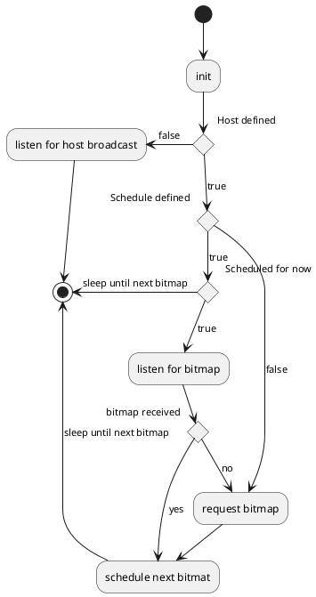

# Overview

Client lifecycle

```plantuml
@startuml

(*) --> "init"

if "Host defined" then 
    --> [true] if "Schedule defined" then
        --> [true] if "Scheduled for now"
            --> [true] "listen for bitmap"
            if "bitmap received"
                --> [yes] "schedule next bitmat"
            else
                --> [no] "request bitmap"
            endif
        else
            -left-> [sleep until next bitmap] (*)
        endif
    else
        --> [false] "request bitmap"
        --> "schedule next bitmat"
        --> [sleep until next bitmap] (*)
    endif
else 
    -left-> [false] "listen for host broadcast"
    --> (*)
endif
@enduml
```