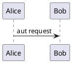

We are using ESP IDF on OpenRTOS.
too

epaper hat to nano layout

| HAT Pin | ESP32 Pin |
|---------|-----------|
| VCC     | 3.3V      |
| GND     | GND       |
| DIN     | GPIO21    |  blue always off
| CLK     | GPIO18    |  yellow always blinky 
| CS      | GPIO5     |  orange always on
| DC      | GPIO17    |  green on while running clear to black
| RST     | GPIO10    |  white blinks on start up
| BUSY    | GPIO9     |  puptulre always off

